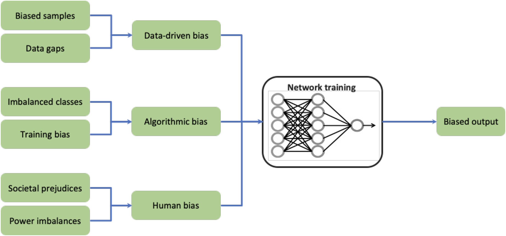

```{r setup, include=FALSE}
knitr::opts_chunk$set(echo = FALSE)
```

Artificial intelligence (AI) and machine learning (ML), in particular, are undoubtedly shaping how decisions are made across several industries. From identifying fraudulent bank transactions to listing the shows and movies we’re most likely to enjoy, AI is deeply embedded within our everyday lives. Oftentimes the results or outputs of these decisions are relatively harmless. However, increasingly, machine learning models are being trained to operate in sensitive domains such as diagnosing diseases or making hiring decisions. While these models have the ability to transform and improve lives, sometimes the decisions made or informed by AI can have far-reaching consequences.

As a part of our team’s bi-weekly journal clubs, we talked about sources of bias for AI models, the potential consequences and harms they can create, and what we can do as data scientists within the healthcare space.

## Bias is everywhere

Bias is a part of human nature, coming from the limited view of the world that any single person or group can achieve. Whether implicitly or explicitly, this bias gets captured within our institutions and by extension - the data that we record. It can be reflected and amplified by artificial intelligence models that are trained using this data. Generally, the bias encoded within AI tools result in the greatest harm toward disadvantaged groups and people, such as racial minorities.

```{r fig.cap="Figure from [ScienceDirect](https://www.sciencedirect.com/science/article/pii/S2666389921002026)", out.extra="class=external", fig.cap="Different types of bias that can exist when training machine learning models"}

```
There are a few different ways bias can affect the prediction or decision made by an algorithm:

* **Human bias**: underlying bias within the data caused by societal inequities and biased human decision-making
* **Data-driven bias**: when training data is not representative of the population in which the algorithm will be applied
* **Algorithmic bias**: when model development or training methods result in biased outcomes

By the same token, harms as a result of biased AI can manifest in different ways:

* [**Harm of allocation**](https://www.reuters.com/article/us-amazon-com-jobs-automation-insight/amazon-scraps-secret-ai-recruiting-tool-that-showed-bias-against-women-idUSKCN1MK08G): if people are denied opportunities or resources based on the decision of an AI. An example of this is Amazon’s resume screening tool that was biased against women because it was trained on data from the past 10 years, which was overwhelmingly male.
* [**Harm of quality-of-service**](https://docs.microsoft.com/en-us/azure/machine-learning/concept-fairness-ml): when an AI tool does not perform at the same level for one group as it does for another. An example of this may be voice assistants trained on predominantly male voices may have trouble recognizing the voices of women who use it.

In this way, AI can be a flawed reflection of our society and its systemic biases, and can become a “gatekeeper” for jobs, medical treatments, and opportunities.

## Healthcare data, like any data, is flawed

Within the context of healthcare services, it is especially important to consider the types of bias within our data, as decisions made with the support of AI have the ability to influence critical decisions such as which patients receive additional care, or what medication dosages are prescribed. As with many other industries, healthcare and medical data can be biased, incorrect, missing, and incomplete.

Even without the presence of AI tools, healthcare data holds implicit bias. For example, when visiting the emergency department for abdominal pain, men wait an average of 49 minutes before receiving an analgesic, whereas women wait an average of 65 minutes [@chen_gender_2008] . The COVID-19 pandemic has also highlighted many existing racial inequities in healthcare, with the morbidity and mortality rate being higher for Black Americans, Native Americans, Pacific Islanders, and Hispanic/Latino patients compared with White Americans [@gawthrop_color_2022].

When machine learning models are trained using data that already contains historical and societal inequities, these patterns are learned by the model, and the biases can be amplified when making predictions for new patients. Models that are deployed with underlying biases can disadvantage the groups who were under or mis-represented within the training data. For example, algorithms trained to identify disease within chest radiograph images were found to have higher underdiagnosis rates for female patients, patients under 20 years old, Black patients, and Hispanic patients. In other words, the risk of being falsely predicted as “healthy” were higher for these groups of people, meaning their clinical treatment would have been delayed or missed entirely [@seyyed-kalantari_underdiagnosis_2021].

## Building fairer models

We know that our models can contain harmful biases. But what can we do as data scientists in the healthcare space to ensure our models benefit the most people, and don’t cause harm? This might be a daunting question, one that led to a lot more questions for our team:

* How can we improve our development and monitoring processes to identify biases before they are deployed? 
* Should we have a feedback loop to communicate data discrepancies and inform future data collection?
* How can we better incorporate the patient experience and expertise? 
* Can we incorporate recourse and contestability into our data science pipelines?

Building fairer models is an iterative process, and one that requires more than one solution. Although not all are possible to implement everywhere, especially all at once, below are a few things our team is learning about and working on:

1. **Understand sources and limitations of data.** Where is the data coming from? Is there potential for any of the variables to be biased?
2. **Build models with an interdisciplinary and diverse team.** When developing any kind of AI tool for clinical deployment, we heavily collaborate with the clinician teams that are involved.
3. **Evaluate model performance across sub-groups and apply techniques for improving explainability.** There are many tools and resources for evaluating model fairness and understanding how a model performs for subgroups. Tools such as [InterpretML](https://interpret.ml/) and [modelStudio](https://modelstudio.drwhy.ai/).
4. **Create and follow standards for data, processes, models, and reporting.** Standardization of these elements of a data science project ensures that there are clear guidelines and expectations, consistency among and across projects, and benchmarks to evaluate quality.
5. **Monitor data, model usage, and performance over time.** Monitoring how our models are performing after deployment is important to ensure there hasn’t been any data drift or changes in the environment that may cause poor performance.

AI has countless potential benefits, especially within healthcare - to improve patient care, hospital efficiency, and support decision-making. Working to build fairer models will help improve trust among clinically deployed AI tools, and ensure that all groups of people can benefit from the decisions made and supported by AI.

## Takeaways

* Human bias, data-driven bias, and algorithmic bias are common ways in which a model might perform poorly for some patient subgroups, causing denial of opportunities or reducing quality of service
* There is no perfect data, but there are different ways to combat bias and build models that are useful and reduce harms
* Some techniques for building better and fairer models include understanding sources of bias, building models considering multiple perspectives, evaluating them for fairness and explainability, and monitoring after deployment

