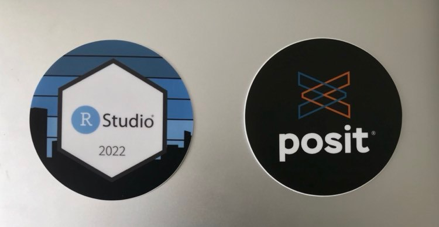

```{r setup, include=FALSE}
knitr::opts_chunk$set(echo = FALSE)
```

## 2 years before

Picture this. It's January 2020, you're in Toronto, it's the middle of winter, you're just back from vacation... and you're suffering from FOMO^[FOMO = fear of missing out] because your teammates are in sunny San Francisco collecting hex stickers, taking selfies with Hadley, and having the time of their lives at [rstudio::conf(2020)](https://www.rstudio.com/resources/rstudioconf-2020/).

We were jealous.

_Fast-forward_... and now WE are the ones living the dream! ✨

```{r out.extra="class=external", fig.cap="Peep the cool background wall!"}
knitr::include_graphics("rstudio_wall.jpg")
```

## 2 weeks before

This was the first time for both of us and we wanted to be ready. Here's how you can do it too!

<input type="checkbox" unchecked>  **Download the RStudio conf app and bookmark all the talks that interest you**. We asked our teammates which topics would be most relevant for the team. We ended up with the following: data science for healthcare, working with Quarto, working with Python, putting things in deployment/production, enhancements to tidymodels, best practices, MLOps/DevOps, training/teaching.</input>

<input type="checkbox" unchecked> **Watch old talks**. These can all be found [here](https://www.rstudio.com/resources/rstudioconf-2020/). We recommend: [debugging](https://www.rstudio.com/resources/rstudioconf-2020/object-of-type-closure-is-not-subsettable/), [RStudio announcing they are PBC](https://www.rstudio.com/resources/rstudioconf-2020/open-source-software-for-data-science/), and [end-to-end data science](https://www.rstudio.com/resources/rstudioconf-2020/deploying-end-to-end-data-science-with-shiny-plumber-and-pins/).</input>

<input type="checkbox" unchecked>  **Make a list of places you want to visit.** We prepared our [sight-seeing and food map](https://goo.gl/maps/pfWeRWhJoPyZFg779). </input>

<input type="checkbox" unchecked>  **Reach out to people who will be attending.** The motto for this year's conference was _"We're always better when we’re together"_. Keeping that in mind, we reached out to our awesome RStudio customer success rep and to our friends that work in healthcare that we met through the Rstudio Community Meetup. It was great to see them in-person!</input>

## During

### Do not skip the keynotes!

We got to experience our very own Oprah moment during the first keynote when the [Posit announcement was made](). Below is a sensationalized retelling of what happened during the very first talk.

<div style="font-family: 'Courier New';"><blockquote>**HADLEY**, shortly after making the Posit rebranding announcement: "Now some of you may be wondering... where are our new stickers?"

**HADLEY** pauses and surveys the crowd with a mischievous look.

**HADLEY**: Now, if you all take a look under your seat...

Intense shuffling sounds can be heard as **THE AUDIENCE** begins to search under their seat. People gasp and laugh as they pull envelopes from under their seat. **MAITREYEE** and **CHLOE** take their envelopes and find two stickers!

```{r out.extra="class=external", fig.cap="Sticker reveal!"}

```

[LATER IN THE EVENING...]

<blockquote class="twitter-tweet"><p lang="en" dir="ltr">In the interest of avoiding widespread panic we’re not moving away from hexagons for package stickers. posit isn’t a package so it gets a different shape <a href="https://twitter.com/hashtag/rstudioconf?src=hash&amp;ref_src=twsrc%5Etfw">#rstudioconf</a></p>&mdash; Hadley Wickham (@hadleywickham) <a href="https://twitter.com/hadleywickham/status/1552290395454951424?ref_src=twsrc%5Etfw">July 27, 2022</a></blockquote> <script async src="https://platform.twitter.com/widgets.js" charset="utf-8"></script></blockquote></div>

### Focus on the content of the talk

Take down key points, but you don't need to write down everything. Materials are available online. If not, most speakers are on Twitter and are happy to answer.

**All** the talks were excellent. The conference put in support for speech coaching and it paid off. All the talks were engaging. The talks were framed as stories. The material was easy-to-digest. 


### Get social! 

There are plenty of opportunities: the night social events + special groups  

Groups of interest:

- R-ladies 

<blockquote class="twitter-tweet"><p lang="en" dir="ltr">Hello from <a href="https://twitter.com/hashtag/RLadies?src=hash&amp;ref_src=twsrc%5Etfw">#RLadies</a> at <a href="https://twitter.com/hashtag/RStudioConf?src=hash&amp;ref_src=twsrc%5Etfw">#RStudioConf</a>!! 👋<a href="https://twitter.com/hashtag/RStudioConf2022?src=hash&amp;ref_src=twsrc%5Etfw">#RStudioConf2022</a> <a href="https://t.co/G9gqxpdnw7">pic.twitter.com/G9gqxpdnw7</a></p>&mdash; R-Ladies Global (@RLadiesGlobal) <a href="https://twitter.com/RLadiesGlobal/status/1553030919828766728?ref_src=twsrc%5Etfw">July 29, 2022</a></blockquote> <script async src="https://platform.twitter.com/widgets.js" charset="utf-8"></script>

- LATAM speakers
- birds of a feather groups! healthcare!!
Attend events!

RStudio is committed to keeping their events inclusive and welcoming, which is highlighted by the [Pac-man concept](https://ericholscher.com/blog/2017/aug/2/pacman-rule-conferences/). Throughout the conference, we felt that.
- pronoun pins

- masks mandatory

- COVID pins

- diversity scholarship


GRAB DESSERT BEFORE LUNCH!!! The dessert table is the first to run out.

### Hex stickers!

Grab t-shirts and hex stickers for your teammates.

Drop by the rLadies event and grab more hex stickers and a [COOL CARD DECK]().

## 2 days after

The three post-conference Rs: 
Reflect think react
(w)Rite talk present 
share Release

**Reflect**: Think about talks that stood out to you.

We both liked: Quarto!! [link to material] And it seems like the community is keen too, because there is already an [Awesome List](https://github.com/mcanouil/awesome-quarto) for Quarto!

Maitreyee's favorite talks:

- highlights of the knitr package

- 3D

- shiny without a server

- tidyclust 

Chloe's favorite talks:

- [Designing a Socially Critical Data Science Course](https://rstudioconf2022.sched.com/event/11iYY/designing-a-socially-critical-data-science-course) by Brian Danielak

- [How Anchorage Built Alaska's Vaccine Finder with R](https://rstudioconf2022.sched.com/event/11iYq/how-anchorage-built-alaskas-vaccine-finder-with-r) by Ben Matheson detailed the amazing work that the Anchorage Innovation Team did to develop and deploy a [mobile vaccine finder](https://anchoragecovidtest.org/). During the talk, Ben highlighted the importance of building and rolling out a MVP (minimum viable product).

- [What they forgot to teach you about industry transitions from academia (WTF AITA)](https://rstudioconf2022.sched.com/event/11iZQ/what-they-forgot-to-teach-you-about-industry-transitions-from-academia-wtf-aita) by Travis Gerke offered some great advice on poeple searching for jobs. While this talk focused on those transitioning from academia to industry, the materials presented will be useful to many! Check out [the cool website](https://wtf-aita.com/)! 

- [A Journey to Data Science: Tools for Equity and Diversity in STEM](https://rstudioconf2022.sched.com/event/11ib8/a-journey-to-data-science-tools-for-equity-and-diversity-in-stem) by Ileana Fenwick

w(R)ite: write a blog post! (this!!)

Release:
sharing the extra Shirts and stickers!
How can we take our findings and apply them...


## 2 months after...?

We want to leverage Quarto. We hope to move this blog to Quarto.

Try Python for Shiny. Our team has a mix of R and Python developers, some who have used Shiny and some who have not.

Create consistent templates and color schemes for organization. Branding is important!

Onboarding - give agency to newcomers. This came up during a few talks. Let the newcomers make changes to your company guide (here at DSAA, we have the DSAA handbook that is used for onboarding purposes). 

Share learning materials. From Jeff Leek's closing keynote: "Mentorship is a debt you don't pay off, you pay it forward". We want to share some of the cool work we do and resources/tutorials, what it's like working as a data scientist in healthcare. This blog is a step towards that.

Create our own hex sticker!

Continue attending workshops, eg Quarto coming up!
