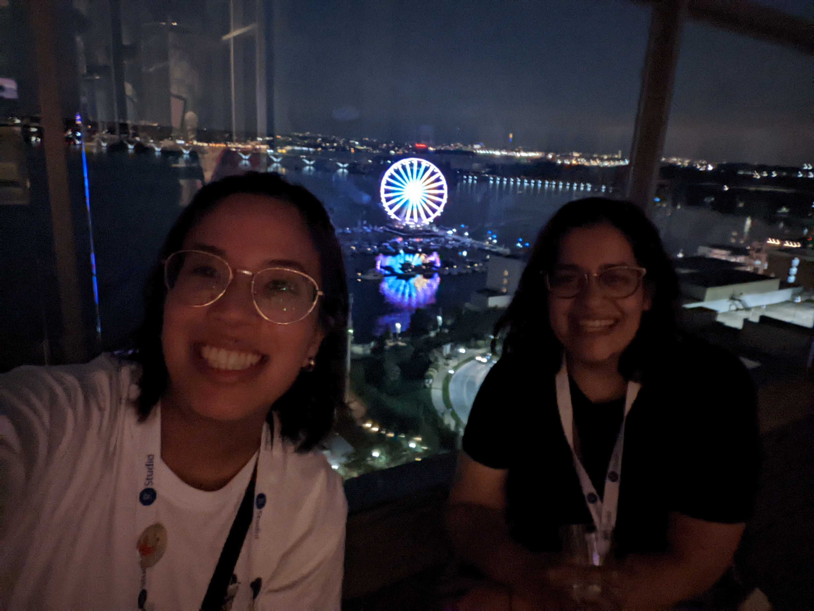
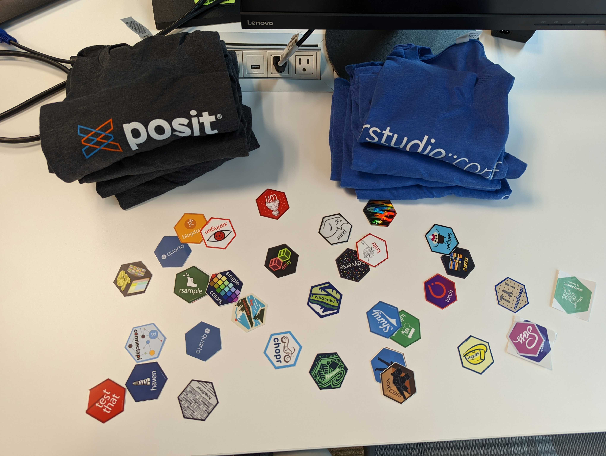

```{r setup, include=FALSE}
knitr::opts_chunk$set(echo = FALSE)
```

## 2 years before

Picture this. It's January 2020, you're in Toronto, it's the middle of winter, you're just back from vacation... and you're suffering from FOMO^[FOMO = fear of missing out] because your teammates are in sunny San Francisco collecting hex stickers, taking selfies with Hadley, and having the time of their lives at [rstudio::conf(2020)](https://www.rstudio.com/resources/rstudioconf-2020/).

We were jealous.

_Fast-forward_... and now WE are the ones living the dream! ✨

```{r out.extra="class=external", fig.cap="Check out the view! Now we are the ones creating FOMO 😎"}

```

## 2 weeks before

This was the first time for both of us and we wanted to be ready. Here's how you can do it too!

<input type="checkbox" unchecked>  **Download the RStudio conf app and bookmark all the talks that interest you**. We asked our teammates which topics would be most relevant for the team. We ended up with the following: data science for healthcare, working with Quarto, working with Python, putting things in deployment/production, enhancements to tidymodels, best practices, MLOps/DevOps, training/teaching.</input>

<input type="checkbox" unchecked> **Watch old talks**. These can all be found [here](https://www.rstudio.com/resources/webinars/).^[Some of our favorites: ["Object of type ‘closure’ is not subsettable" by Jenny Bryan](https://www.rstudio.com/resources/rstudioconf-2020/object-of-type-closure-is-not-subsettable/), ["Open Source Software for Data Science" by JJ Allaire](https://www.rstudio.com/resources/rstudioconf-2020/open-source-software-for-data-science/), ["Deploying End-To-End Data Science with Shiny, Plumber, and Pins" by Alex Gold](https://www.rstudio.com/resources/rstudioconf-2020/deploying-end-to-end-data-science-with-shiny-plumber-and-pins/).]</input>

<input type="checkbox" unchecked>  **Reach out to people who will be attending.** The motto for this year's conference was _"We're always better when we’re together"_. Keeping that in mind, we reached out to our awesome RStudio customer success rep and to friends we had met through the [RStudio Community Meetup](https://www.meetup.com/RStudio-Enterprise-Community-Meetup/). It was great to see them in-person!</input>

<input type="checkbox" unchecked>  **Make a list of places you want to visit.** We prepared our [sight-seeing and food map](https://goo.gl/maps/hUjuyq6cm46smada8).</input>


## During

### Do not skip the keynotes!

We got to experience our very own Oprah moment during the first keynote when the [Posit announcement was made](https://www.rstudio.com/blog/rstudio-is-becoming-posit/). Below is a sensationalized retelling of what happened during the very first talk.

<div style="font-family: 'Courier New';"><blockquote>**HADLEY**, shortly after making the Posit rebranding announcement: "Now some of you may be wondering... where are our new stickers?"

**HADLEY** pauses and surveys the crowd with a mischievous look.

**HADLEY**: Now, if you all take a look under your seat...

<center></center>

Intense shuffling sounds can be heard as **THE AUDIENCE** begins to search under their seat. People gasp and laugh as they pull envelopes from under their seat. **MAITREYEE** and **CHLOE** take their envelopes and find two stickers!

```{r out.extra="class=external", fig.cap="Sticker reveal!"}
knitr::include_graphics("r_posit_stickers.jpg")
```

[LATER IN THE EVENING...]

<blockquote class="twitter-tweet"><p lang="en" dir="ltr">In the interest of avoiding widespread panic we’re not moving away from hexagons for package stickers. posit isn’t a package so it gets a different shape <a href="https://twitter.com/hashtag/rstudioconf?src=hash&amp;ref_src=twsrc%5Etfw">#rstudioconf</a></p>&mdash; Hadley Wickham (@hadleywickham) <a href="https://twitter.com/hadleywickham/status/1552290395454951424?ref_src=twsrc%5Etfw">July 27, 2022</a></blockquote> <script async src="https://platform.twitter.com/widgets.js" charset="utf-8"></script></blockquote></div>

### Focus on the content of the talk

We didn't need to take extensive notes during the talks, since materials are available online. 

RStudio cares about the quality of the presentations. All speakers received [coaching](https://www.rstudio.com/blog/new-deadline/) and it paid off. All the talks were engaging, easy-to-follow, and easy-to-digest. 


### Get social! 

There were plenty of opportunities for socializing and networking. 

- The **evening reception** was a great place to meet people over drinks, music, and games.

- The **R-ladies Meetup** allowed us to meet awesome women that work with R, grab some hex stickers, and pick up the [Women in STEM card deck](https://github.com/ambertin/women-in-stem).

<blockquote class="twitter-tweet"><p lang="en" dir="ltr">Hello from <a href="https://twitter.com/hashtag/RLadies?src=hash&amp;ref_src=twsrc%5Etfw">#RLadies</a> at <a href="https://twitter.com/hashtag/RStudioConf?src=hash&amp;ref_src=twsrc%5Etfw">#RStudioConf</a>!! 👋<a href="https://twitter.com/hashtag/RStudioConf2022?src=hash&amp;ref_src=twsrc%5Etfw">#RStudioConf2022</a> <a href="https://t.co/G9gqxpdnw7">pic.twitter.com/G9gqxpdnw7</a></p>&mdash; R-Ladies Global (@RLadiesGlobal) <a href="https://twitter.com/RLadiesGlobal/status/1553030919828766728?ref_src=twsrc%5Etfw">July 29, 2022</a></blockquote> <script async src="https://platform.twitter.com/widgets.js" charset="utf-8"></script>

- The [Birds of a Feather groups](https://www.rstudio.com/bof/) provide an opportunity to meet people that work on the same problems or use the same tools as you. We attended the Healthcare Birds of a Feather group and got to meet plenty of data practitioners who offered us insights into how things work at other hospitals and health institutions.

### Create a POSITive space

RStudio is committed to keeping their events inclusive and welcoming, which is highlighted by the [Pac-man rule](https://ericholscher.com/blog/2017/aug/2/pacman-rule-conferences/). During the conference, their actions supported their words through the use of pronoun pins, a masking policy, the use of color-coded "social distance" pins^[The available pins were: "Hugs okay", "Handshakes or fist bumps", "Elbows", and "Please keep your distance"], and [diversity scholarships](https://www.rstudio.com/blog/rstudio-conf-2022-is-open-for-registration/).


### Things no one will tell you...

**Grab food from the dessert table before the main food table.** We learned this the hard way. Desserts disappear as fast as holographic hex stickers. 

Speaking of stickers... make sure to **grab hex stickers for your teammates**.

```{r out.extra="class=external", fig.cap="Sharing the swag!"}

```

## 2 business days later

These were our favorite talks:

- [Hello Quarto: Share • Collaborate • Teach • Reimagine](mine.quarto.pub/hello-quarto) by Mine Cetinkaya-Rundel & Julia Stewart Lowndes gave us a glimpse of all the awesome things we could do with Quarto. We were super excited after watching this. And it seems like the community is keen too, because there is already an [Awesome List](https://github.com/mcanouil/awesome-quarto) for Quarto!

- [How Anchorage Built Alaska's Vaccine Finder with R](https://rstudioconf2022.sched.com/event/11iYq/how-anchorage-built-alaskas-vaccine-finder-with-r) by Ben Matheson detailed the amazing work that the Anchorage Innovation Team did to develop and deploy a [mobile vaccine finder](https://anchoragecovidtest.org/). During the talk, Ben highlighted the importance of building and rolling out a MVP (minimum viable product).

- [Introducing workboots: Generate prediction intervals from tidymodel workflows](https://sched.co/11iZW) by Mark Rieke introduced us to an R package for generating bootstrap prediction intervals within a tidymodel workflow. For a field like healthcare where uncertainty is relevant, this will be useful for us to incorporate in our projects, most of which are built with the tidymodels workflow.

- [What they forgot to teach you about industry transitions from academia (WTF AITA)](https://rstudioconf2022.sched.com/event/11iZQ/what-they-forgot-to-teach-you-about-industry-transitions-from-academia-wtf-aita) by Travis Gerke offered some great advice on poeple searching for jobs. While this talk focused on those transitioning from academia to industry, the materials presented will be useful to many! Check out [the cool website](https://wtf-aita.com/)! 

- [A Journey to Data Science: Tools for Equity and Diversity in STEM](https://rstudioconf2022.sched.com/event/11ib8/a-journey-to-data-science-tools-for-equity-and-diversity-in-stem) by Ileana Fenwick highlighted open science tools and communities to further equity and diversity in STEM. 

- [Building a ggplot2 rollercoaster: Creating amazing 3D data visualizations in R](https://sched.co/11ibS) by Tyler Morgan-Wall showcased some cool things that can be done with `ggplot2`. [Check out this awesome video!!](https://www.tylermw.com/wp-content/uploads/2021/03/ggrollerwideprevnew4.mp4)


## 2 months later...?

We hope to achieve the following:

- **Create our own hex sticker!** 

- **Integrate Quarto into our workflows**. We hope to move this blog to Quarto. [This tutorial](https://blog.djnavarro.net/posts/2022-04-20_porting-to-quarto/) will be a great starting point.

- **Try Python for Shiny**. Our team has a mix of R and Python developers, some who have used Shiny and some who have not. 

- **Create templates with consistent color schemes**. This came up during many of the Quarto-related talks. A quick and easy way to make reporting easier is to use consistent branding.

- **Give agency to newcomers during onboarding**. This came up during many talks. The idea is to let newcomers contribute to the code on Day 1.

- **Share learning materials**. From Jeff Leek's closing keynote: _"Mentorship is a debt you don't pay off, you pay it forward"_. We want to share some of the cool work we do and resources/tutorials, what it's like working as a data scientist in healthcare. This blog is a step towards that.

