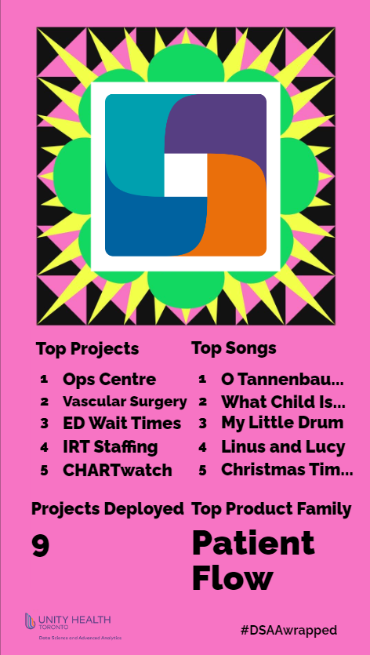

```{r setup, include=FALSE}
knitr::opts_chunk$set(echo = FALSE)
```

The end of the year is a time for reflection, reminiscing, and sharing screenshots of our Spotify Wrapped. For those who are unfamiliar, Spotify Wrapped is a yearly marketing campaign by Spotify, where they compile streaming data and create a personalized graphic for each user. ^[We surveyed the members on DSAA and found that the most listened music genre is: ???] 

In the spirit of data, end-of-year reflections, and colorful infographics, we thought it would be fun to create our very own DSAA wrapped!



Enjoy some stats!!

# Projects

2022 was a busy year with lots of projects!!

- Total \# of projects deployed: 7

- Most viewed project: Ops Centre

    - The Ops Centre project is....
    
- Project with the most team members whose names start with _M_^: Hemodialysis

    - The Hemodialysis project is...
    

# Product families

2022 was the year of _product families_.


What's a product family?

> A product family is....


Some product family stats!

- Number of product families: ??

- Product family with the most projects: Patient Flow??

# DSAA and improvement

2022 was a year where we focused on improving existing operations.

- \# of sprint improvement weeks: 3

    - The sprint improvement week is a week where we....
    
    - Some notable achievements from past sprint improvement weeks are ...
    
- \# of blog posts: 5
  
    - 2022 is when we re-launched this blog! 
    
- \# of journal club sessions lead by the Advanced Analytics team: at least 16

    - We covered the following topics: [add links to ethics & DEI], anomaly detection^[blog post coming soon! :-)], survival analysis, Canadian healthcare.
    
- \# of "sheets" created: 3

- \# of Advanced Analytics mini-demos: 8

    - Mini-demos are lead by a different Advanced Analytics team member..... Add link to Derek's funneljoin here
    
# DSAA's social committee

Our team's social committee (a.k.a. the Party Planning Committee) (a.k.a. the Party Planning Pandas) have organized some GREAT events this year.

- \# of steps completed during the Step Challenge: 1,983,000

    - The Step Challenge was 1-week challenge in May where team members were encouraged to get as many steps in as possible!
    
- \# of "wizard" classes: 3

    - Wizard classes are DSAA-lead classes to learn something fun. This year we learned, how to bake puff pastries, how to play euchre and how to make pizza.
    
    - Speaking of pizza....
    
- \# of pizzas made by DSAA team members: $\infty$

[add pics of pizza here???]

- Most requested album: The Charlie Brown Christmas soundtrack

    - [something baout solo work together channel]


