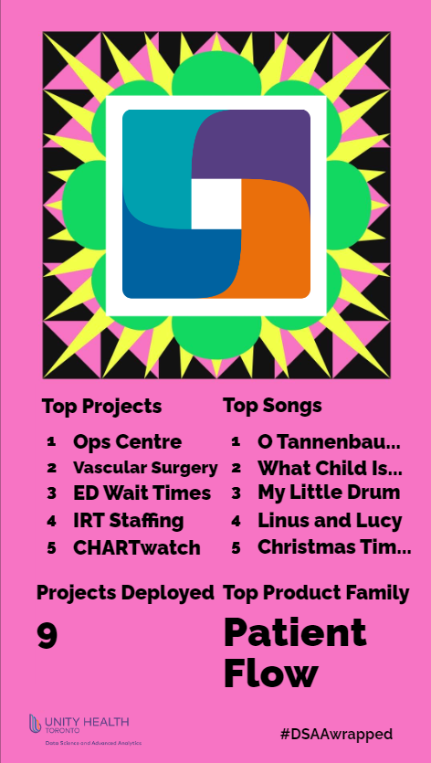
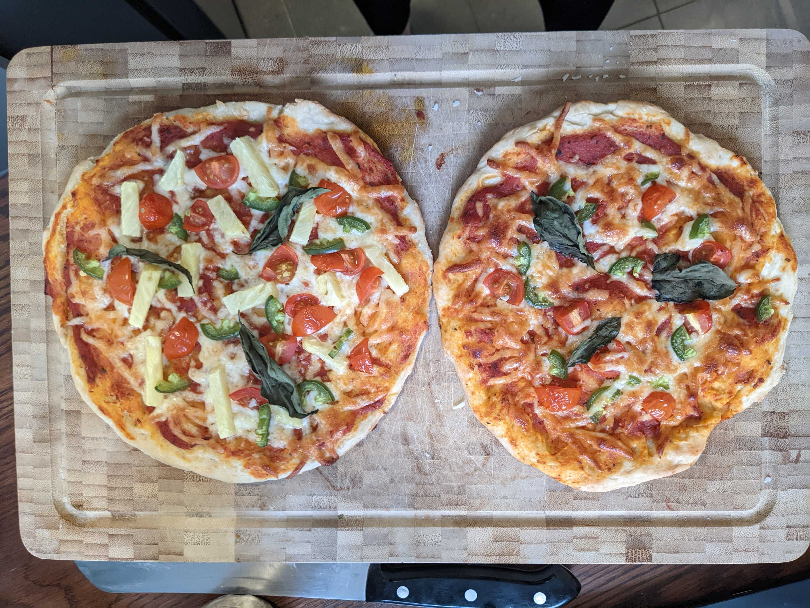
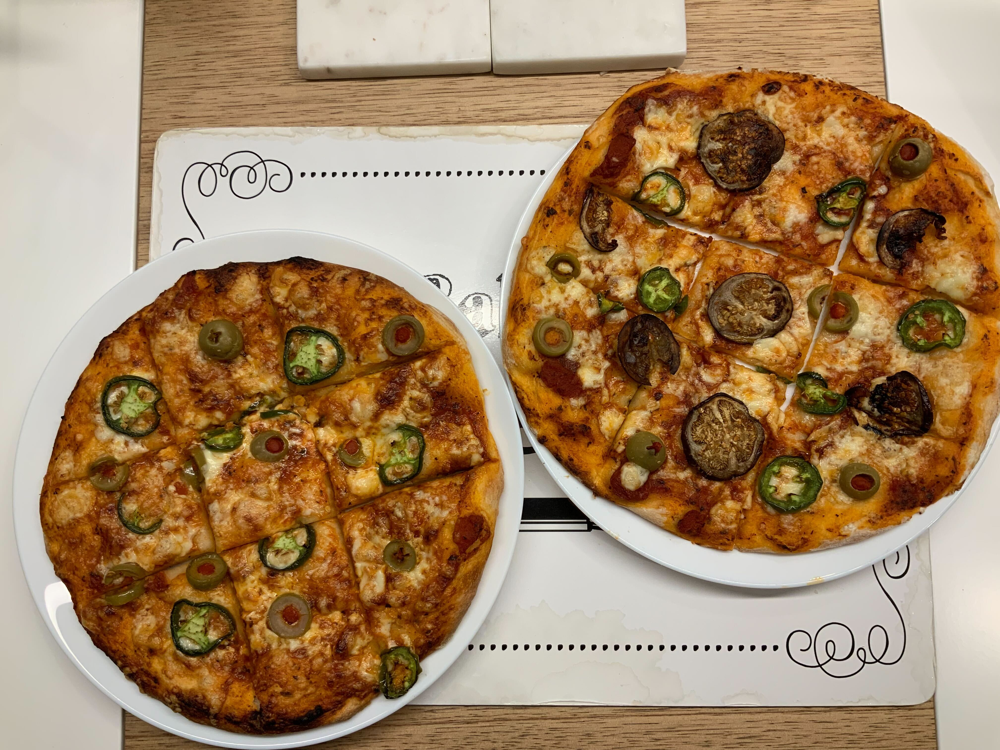

```{r setup, include=FALSE}
knitr::opts_chunk$set(echo = FALSE)
```

The end of the year is a time for reflection, reminiscing, and sharing screenshots of our Spotify Wrapped. For those who are unfamiliar, Spotify Wrapped is a yearly marketing campaign by Spotify, where they compile streaming data and create a personalized graphic for each user. ^[We surveyed the members on DSAA and found that the most listened music genre is _Pop_, followed by various interesting variations of _Indie_ (indie pop, indie soul, indie Québécois).] 

In the spirit of data, end-of-year reflections, and colorful infographics, we thought it would be fun to create our very own DSAA wrapped!

Enjoy some stats!! 

```{r}

```

# Projects

2022 was a busy year with lots of projects!!

- Total \# of projects deployed: 9

- Most viewed project: Ops Centre

    - The Ops Centre project provides a clear picture of patient flow within the hospital. It consists of multiple data tiles that reflect real-time data in the areas of occupancy, upcoming discharges, planned admissions, bed cleaning, portering, and other elements essential to providing a full-picture of patient flow.
    
- Project with the most team members whose names start with _M_: Hemodialysis

    - The Hemodialysis project is a weekly digest tool for clinicians at the St. Michael's Hospital hemodialysis clinics. The tool provides patients' risks of a unplanned hospital visits. 
    

# Product families

2022 was the year of _product families_.^[Blog post coming soon!! 🤞]


Whoa, wait. What exactly is a product family? 

- **Product** at DSAA is a _platform, application, system, or report_ that is created to meet patient, clinician, or hospital operational needs.

- **Product family** (roughly comparable to a product line) is a group of related products that are developed and maintained by a single cross-functional team at DSAA. 

- We adopted this custom framework in order to allow staff to work effectively within persistent teams and to leverage resources across products the best we can. The products under each product family are related by common product value and/or shared domain expertise requirement.


Some product family stats!

- Number of product families: 6

- Product family with the most projects: The _Patient Flow_ product family ^[Fun fact: The _Patient Flow_ product family is also the product family with the most Fast & Furious memes.]

    - The _Patient Flow_ product family aims to make the patients journey though the hospital as safe and comfortable as possible without compromising care. The _Ops Centre_ is an example of a project that is part of this family.

# DSAA and improvement

2022 was a year where we focused on improving existing operations.

- \# of sprint improvement weeks: 3

    - The sprint improvement week is a full week dedicated to DSAA process improvement work in the areas of data infrastructure, source system optimization, DevOps, data governance, databases, analytics and project management processes, and more! The DSAA team works together to clear a backlog of tasks, and then we share our accomplishments through demos at the end of the week.
    
    - Some notable achievements from past sprint improvement weeks are: our very own DSAA handbook, maintenance and update of internally-developed packages, and experimenting with containers!
    
- \# of blog posts: 5
  
    - 2022 is when we re-launched this blog! 
    
- \# of journal club sessions lead by the Advanced Analytics team: at least 16

    - We covered the following topics: [AI ethics, equity, & inclusion](https://github.com/LKS-CHART/AA_journal_club/tree/main/2022_01_Ethics_Bias_Inclusion), anomaly detection^[blog post coming soon! :-)], survival analysis, Canadian healthcare.
    
- \# of "sheets" created: 3^[Blog post coming soon!!! 🙏]

    - Templates! Templates! Templates! We worked on templates for: [Datasheet](https://arxiv.org/abs/1803.09010), [Factsheet](https://aifs360.mybluemix.net/examples), and [Models ~~card~~ sheet](https://vetiver.rstudio.com/learn-more/model-card.html).

- \# of Advanced Analytics mini-demos: 8

    - Mini-demos are lead by a different Advanced Analytics team member and include (you guessed it) a mini-demo!! Usually, one of the team members will try out a cool new package or talk about a fun/interesting/challenging problem they ran into. For example, we had a mini-demo on the [funneljoin package](https://lks-chart.github.io/blog/posts/2022-08-12-putting-the-fun-in-funneljoin/).
    
# DSAA's social committee

Our team's social committee (a.k.a. the Party Planning Committee) (a.k.a. the Party Planning Pandas) have organized some GREAT events this year.

- \# of steps completed during the Step Challenge: 1,983,000

    - The Step Challenge was 1-week challenge in May where team members were encouraged to get as many steps in as possible! The max \# of daily steps was 32,998 and the min \# of daily steps was 246.
    
- \# of "wizard" classes: 3

    - Wizard classes are DSAA-lead classes to learn something fun. This year we learned how to bake puff pastries, how to play euchre and how to make pizza.
    
    - Speaking of pizza....
    
- \# of pizzas made by DSAA team members: $\infty$

    - Pizza lesson night was very popular!!! Check out some of delicious pizzas that team members made:
    




- Most requested album: The Charlie Brown Christmas soundtrack

    - During the year, many of our team members would hop on a Zoom call, play some music, and work together. The most played album was the [Charlie Brown Christmas soundtrack](https://open.spotify.com/album/2XnNY3GEkbWHor5kyvXLu4?si=d6403b3e25044832), very closely followed by [lo-fi chill hip hop](https://open.spotify.com/playlist/0vvXsWCC9xrXsKd4FyS8kM?si=d7adae6166e04ef2).
    
  
# ... and that's a wrap!

2022 was a great year and we're looking forward to 2023.

Some things you can expect in the new year:

- More blog posts!!!!!!!!^[We promised a few in this blog post, so now we're on the hook!]

- More pizza!

- More journal club sessions. We're looking forward to reading up on NLP and timeseries!

- More steps!