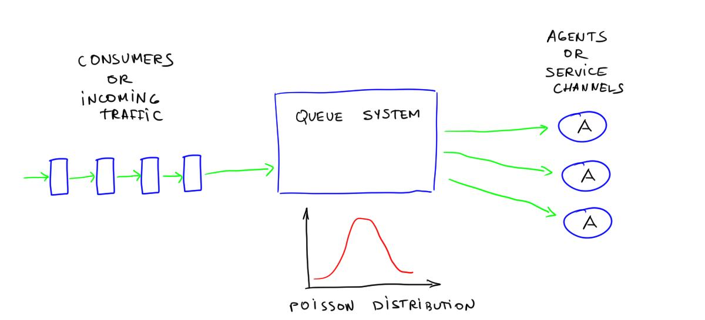
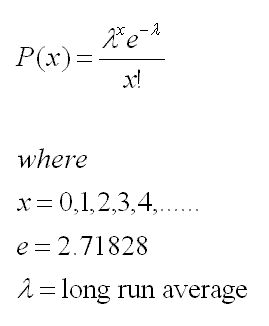

```{r setup, include=FALSE}
knitr::opts_chunk$set(echo = FALSE)
```

# Discrete Events Simulation at Providence Outpatient Care & Services Covid-19 Recovery scheduling


Discrete Events Simulations (DES) are a method of modeling the operation of real world systems digitally.  It does this by modeling a series of events in time.  Each event is ordered by time of occurrence, and the system is advanced to each event in the sequence, meanwhile updating the state of the system.  This is done so that we can test hypothetical changes to the system and their impacts on metrics we are interested in, uncover bottlenecks or process challenges, and make overall assessments of the system.

This type of simulation is particularly useful at modeling a system with many uncertain or probabalistic steps (such as you don't know when your next customer or patient will arrive, and you don't know how long and what resources are required to help that customer or patient.)  In systems where there are a complex number of steps, many different resources, inputs and outputs, DES may be one of the only possible ways to model.
The underlying statsical theories that support DES come from queueing theory.  A classic example of queueing theory is the call center.  In a call center you have incoming calls.  You may know roughly how many calls you can expect on a day, or any given hour, and hence you know the frequency of calls.  



However you do not know exactly when your next call will arrive (remember this is probabiltic or uncertain).  This is known as a poisson arrival process, and is modeled as:



Lambda is the only paramter that Poisson depends on.  This is your arrival rate (on average.)  

Queueing theory works well for a simple queue like this, where you have a single entry point for your customers, a single type of service (answering the call) with some probabalistic length of time and one exit for your customer (end of call).

However with more complex system, such as an Emergency Department, we may have patients who arrive in multiple ways, have multiple possible treatments or interventions, and could have multiple exits (admission, discharge) the formulas for Queueing theory become inpracticle to model these systems.  That is when we need DES!

## Background

Simulation had long been used in manufacturing as there can be considerable variability in process outputs in a manufacturing line.  In addition to variability, having a birds eye view of the entire process can allow us to easily assess bottlenecks in our system.  Bottlenecks could be caused by varability in our process outputs, overprodcution, excess inventory, high down time or failures in machines, lack of staff or resources.  

We can also then make assessments to changes in our system.  Lets say for example we add an additional staff member at a point in our process.  Does this improve our bottleneck?  What if we replicate a few steps in our process and run parallel production?  Will the cost to do implement this strategy be outweighed by the benefits gained by a reduced bottleneck in this area?  We can assess this in our simulation before trying it in our real world system.

In addition to manufacturing, DES can be used in call centers, retail stores, warehouses, airports, EMS services and increasingly DES is used to improve healthcare systems.

In each these cases, DES is commonly used to evaluating capital investment decisions, staffing or scheduling changes, evaluate process efficiencies, and even to predict bottlenecks in live systems.

Commonly in healthcare, DES is used to evaluate Emergency Departments, Operating Room Suites, ICU/PACU, and Inpatient and Outpatient units.  The objectives of DES in Healthcare is overwhelmingly to evaluate the effects of operational changes followed by staff and patient scheduling.

At Unity Health Toronto we have used DES to evaluate changes to the physicial layout in the Emergency Department (ED), assess changes to Physician Scheduling in the ED and most recently, assess patient appointment scheduling for outpatient services.


## DES software

There are many software applications that can build DES models available.   Some provide an installer and can be used on a windows PC (ARENA, Anylogic, FlexSim, Rockwell Arena, Simul8, etc).  This is great for use in 1 time simulations when you will infrequently reassess your system.

We also have DES software that can be hosted remotely and can accept simulations as jobs ([Simul8](https://www.simul8.com/) has this feature).  This type of software can be useful when you want to run a simulation more frequently, perhaps even live to predict possible incoming bottlenecks. At Unity Health we have used Simul8 in the past for one time scheduling and capital allocation decisions.


There are also many open source DES packages now available.  Examples include [DESMO-J](https://en.wikipedia.org/wiki/DESMO-J), which is avaialble in Java, [Facsimile](https://index.scala-lang.org/facsimile/facsimile), in Scala, and [SimPy](https://simpy.readthedocs.io/en/latest/), avaialble in Python.

For our latest project, we wanted to host an application where the user could enter in patient schedules and run the simulation remotely, on demand.  We chose SimPy to accomplish this.


## Providence Outpatient Simulation Project

The Providence Healthcare Center(PHC) Outpatient Service Department consists of multiple clinics providing medical appointments.  Each patient arrives, registers, and wait for the appointment in the waiting areas or vehicle.  They will then be escorted to clinical waiting areas or directed into a room.  After the appointment, they may continue to wait in the clinical waiting areas for follow ups or leave the hospital.  During this process, there may be congestion resulting from a combinations of patient behaviors, system resource and capacity (early-arrival of wheel-trans patients, max room capacity, lack of therapists); A smooth outpatient process is important for the hospital system to run efficiently for optimal patient care and quality of service.

At Providence, with the second Covid-19 pandemic dwindling, we wanted to test schedules to cut down the growing backlog of outpatient appointments required to fill while ensuring safe social distancing practices within the hospital.


Under COVID regulations, all individuals are required to maintain social distancing between each other.  To follow the regulation and minimize unnecessary contacts, the Outpatient Service Department needs to control the maximum number of patients in each area of the department.  
Planning to reopen more outpatient services (and to reduce the backlog created by shutdowns during the first two waves of the pandemic), the outpatient department wants to test adding additional appointments to their schedule with a combination of more staffing, longer hours, more patients and additional working days, while maintaining social distancing requirements.  


The solution that was deployed for the PHC Outpatient Service Department consists of two parts:

1) A simulation model that helps recreate the physical space capacity and analyze the system & process performance

2) Designing a web user interface that requires users to input key features of the simulation for testing different scenarios. In addition, the model would output key performance indicators to help access the performance of the proposed plans/system. 

The primary input that our user can manipulate to test out scenarios is the appointment schedule.  This appointment schedule include a breakdown of the types and quantities of appointments that would be seen in Inpatient services by the day of the week (Mon, Tue, Wed..).


The simulation model consists of three main parts:

- A defined object class called “Patient” with all necessary attributes and pre-defined calculation functions for results and outputs. Attributes include but not limit to: Patient index, appointment type, appointment clinic, probability of the patient needing wheel chair transportation from his/her home, and more.

- The second part consists of logging, status update, capacity checking and calculation functions for the simulation process. Some of the process Detailed information of patient arrivals are calculated and recorded through these supporting functions.

- The last part is the simulation model function, where it reads in user defined clinics’ capacity, registration time, and input data excel file. The model then reads the patient schedules and generates patients based on their scheduled appointment time. 


- INITIALIZATION: Patients have two types, virtual or in-person. Virtual patients can escape all the registration steps, directly start their therapy appointment if available and leave immediately after appointment. In-person patients would just simply follow the normal outpatient process. 
- ARRIVAL: The simulated in-person patients would arrive to the registration desk, either on their own or by wheel-trans. Their arrival type is determined based on the wheel-trans arrival probability and python randomizer. In the registration wait room, if there is enough space to allow new patients in, new patients can then get registered; else new patients would have to wait for new capacity coming up to enter the registration room.
- THERAPY: Once patients get registered, a schedule check would occur to see if the room and therapist booked for this patient(s) are available. If available, status would be updated, and patients can proceed to their appointments immediately. If not, patients would have to wait until the clinic/therapist is ready.
- DIMISSAL: During dismissal, the arrival type is first checked. If the patient arrived by wheel-trans, then the registration wait room capacity would be checked to see if there is any space available for the leaving patients. If yes, wheel-trans patients can wait till their wheel-trans service arrive. If not, they will have to wait in the clinic wait rooms for an upcoming space. If the patient arrived on their own, they could leave immediately after their appointment. Status of current room capacities would be updated accordingly. 

•	During this, process, all related/interested performance stats (wait time, current number in system) are recorded for result calculations. Utilization plots for clinics/therapists are also plotted for easier understanding. 
Limitations:
The simulation model itself basically replicates the normal outpatient service process but simplifies it by ignoring some of the variabilities in process times due to the lack of data. Instead of fitting a time distribution, we had to use a more deterministic approach by assuming a static service time for all the servicing times involved in the model. However, once enough data is collected, those distributions can be obtained by data-fitting and directly apply to the model. In this way, the model would have more randomness, and thus more realistic comparing to real life.


