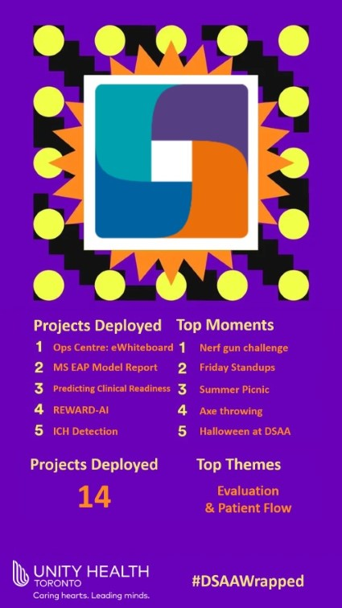
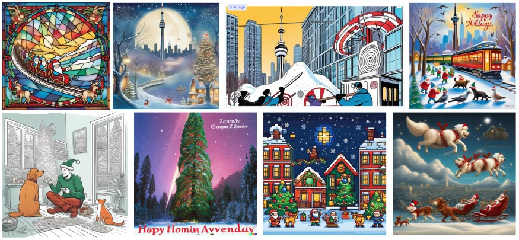

```{r setup, include=FALSE}
knitr::opts_chunk$set(echo = FALSE)
```

It's the end of the year, and that means it's time for another DSAA Wrapped!

Our DSAA Wrapped is based on Spotify Wrapped, an annual data-driven summary of each user's listening habits and trends over the past year. These recaps are showcased in engaging visual summary cards, which are shared widely with friends and across social media platforms. 

Here's our version, showcasing some of our project deployments and top team moments. This year, we focused heavily on evaluating some of our existing tools that have been deployed, and on projects that aim to improve patient flow!

```{r}

```

# Projects

This year, we deployed a whopping **14 projects** across all of our product families! That's more projects than the number of pizzas we've consumed this year (okay, maybe not that many, but close).

Our product and data wizards worked their magic, and the project that stole the show in terms of views was once again none other than... the **Operations Centre**! The Ops Centre project offers an overview of patient movement within the hospital. It comprises various pages that display real-time information related to planned admissions, occupancy, upcoming discharges, bed cleaning, portering, and other critical elements necessary for a holistic understanding of patient flow.

# The Avengers of data science

When it comes to assembling a team, our project with the most team members, **Predicting Clinical Readiness** with **14 members**, resembled an Avengers movie—full of diverse talents, occasional challenges, and ultimately, a blockbuster success. The aim of this project is to identify General Internal Medicine patients at St. Michael's Hospital who are likely to become medically stable so that discharge related activities can start earlier in the patient's hospital stay, ultimately achieving better patient flow and minimizing delays.

# Product family royalty 👑

In a year that saw projects popping up like mushrooms after rain, the **Patient Flow** family stood tall, boasting the crown for the most projects.

Speaking of product families, we had a new product family join us this year... the **Signal1** family, a collaboration between DSAA and [Signal1](https://signal1.ai/), bringing our total number of product families to **6**! They are also the family with the most team members at **11 members**.

# Sprint improvement weeks 🛠️

In 2023, we had **2** sprint "improvement" weeks which were as fun and productive as ever, as we reached a milestone of **10 sprint weeks** completed till date! From cross-team brainstorming sessions to infrastructure improvements, we emerged stronger, wiser, and with a new found appreciation for the power of espresso breaks. In our 10th sprint week, we had **32 tasks** in the backlog, **20 accomplishments demoed**, and **4 pizzas** eaten.

# The learning never stops

At DSAA, the learning never stops!

In our team-wide journal clubs, we learned about:

- [The Five Ideals](https://www.youtube.com/watch?v=xyP3c8VWplM)  
- [Lawsuits in the domain of generative AI](https://www.theverge.com/2023/1/17/23558516/ai-art-copyright-stable-diffusion-getty-images-lawsuit)  
- [Problems in the deployment of ML models in healthcare](https://www.theverge.com/2023/1/17/23558516/ai-art-copyright-stable-diffusion-getty-images-lawsuit)  
- [Clean code in Python](https://github.com/zedr/clean-code-python)  
- and more!

This year, our Advanced Analytics (AA) sub-team had **more than 10** journal club sessions that dived into the worlds of Natural Language Processing (NLP), performance optimization, and project evaluation. The AA team also had the chance to take their learning outside of the office, by going on a field trip to the Thomas Fisher Rare Book Library at U of T, which had an exhibit of [Data Visualization Throughout History](https://fisher.library.utoronto.ca/exhibition/emerging-patterns-data-visualization-throughout-history).

We were also fortunate to have Posit host a number of workshops for us, covering the topics of [pointblank](https://github.com/rstudio/pointblank) and [MLOps with vetiver](https://juliasilge.github.io/mlops-with-vetiver/#/title-slide).

# Sharing ideas

This year, we didn't just learn new things, our team members also had opportunities to exchange ideas, and share insights and experiences through talks and conferences. Our team presented about the Hemodialysis project at the [Renal Insight](https://www.constellationkidney.com/electronic-health-records/renal-insight/) User Group Meeting, shared lessons from implementing AI in healthcare from the CHARTwatch project and beyond, and discussed [estimating ROI for analytics and data projects](https://www.linkedin.com/feed/update/urn:li:activity:7143660747309416448/).

We also hope to continue to raise our count of published blog posts! This past year, we've had team members share **3 blog posts** about [developing and deploying AI solutions in the hospital](https://lks-chart.github.io/blog/posts/2023-01-27-with-a-little-help-from-my-friends/), [creating reproducible environments for building medical imaging machine learning models with Nix](https://lks-chart.github.io/blog/posts/2023-02-28-medical-imaging-with-nix/), and [discrete event simulation in healthcare](https://lks-chart.github.io/blog/posts/2023-03-17-introduction-to-discrete-event-simulations-in-healthcare/).

# The Party Planning Pandas and beyond! 🎉

Let's recount some of our memorable team moments from this past year, organized by our social committee: The Party Planning Pandas 🐼.

- Nerf Gun Challenge: With our in-office stash of nerf guns, during this challenge, our team learned that precision and luck go hand in hand.  
- Valentine's Day & Zoom trivia: This year, our data science team embraced AI art generators to craft charming (and maybe a little scary) Valentine's Day cards as well as adorable baby animal versions of our team.  

```{r}

```

- Summer Picnic: Sun, fun, and ICE CREAM — our summer picnic at Riverdale Park in Toronto included some painting with marshmallows, an ice cream truck, and a scavenger hunt that turned into an extended visit to Riverdale Farm!  
- Halloween at DSAA: Our team members transformed into a raccoon, Snow White, Wednesday Addams, and everything in between.  
- Axe Throwing: We traded our laptops for axes and unleashed our inner warriors. Let's just say, our aim in data science translated surprisingly well to hitting bullseyes.  

As we wrap up this year's Wrapped, let's share a round of applause for our incredible team at DSAA and all of our collaborators. Here's to a year of innovation, collaboration, pizza, and data-driven successes!

We'll leave you with some of our AI-generated holiday cards, happy holidays!

```{r}

```
