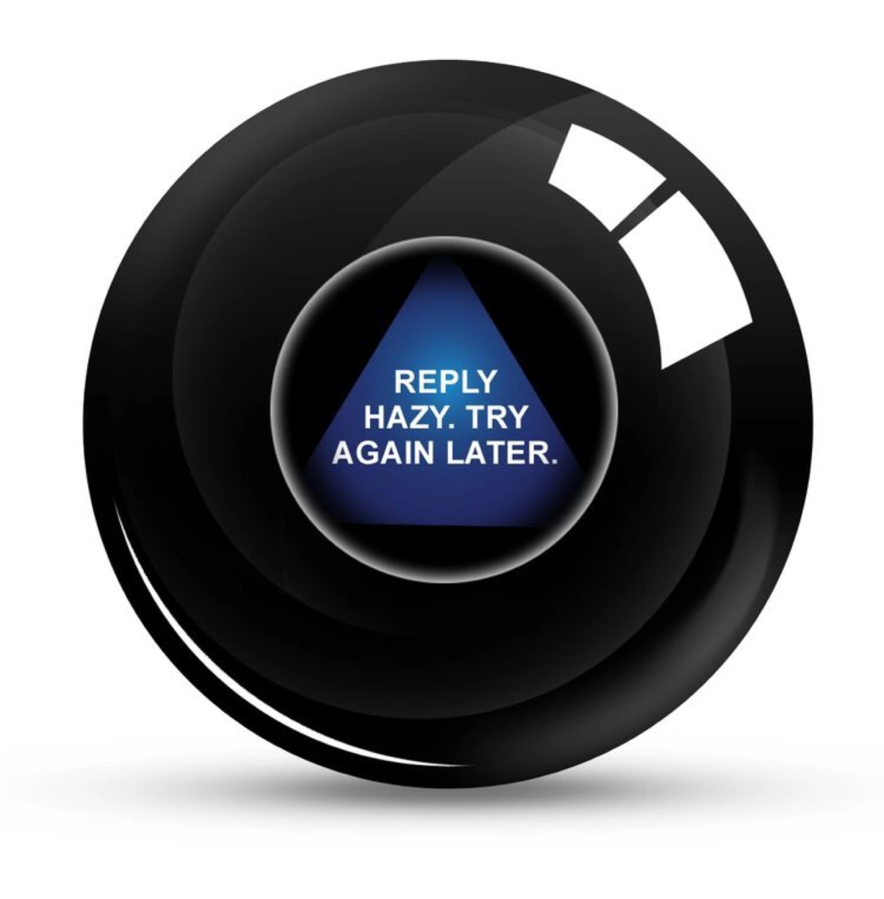

```{r setup, include=FALSE}
knitr::opts_chunk$set(echo = FALSE)
```


Confession: I rarely write unit tests. 😅 [^1]

[^1]: Yes, I know. They're important and they help find critical failures. Just enter "Are unit tests worth it?" in your favorite search engine, and you'll end up with a mountain ⛰️ of blog posts, StackOverflow replies, Reddit comments, heated discussions, etc. that tell you: *yes, unit tests are worth it*.

That being said, I did recently run into an issue that was identified by a unit test!!

## What happened?

**The situation**: We recently updated Data Virtuality (DV), our data integration platform which consolidates data from various hospital source systems and lets us interact with data through a unified SQL API.[^2]

[^2]: We like [Data Virtuality](https://datavirtuality.com/) because:

    -   It has a layer of abstraction between source systems and data consumers. This means that, as a data scientist, I can access real-time data from one view.

    -   Any changes to source systems are dealt with at the virtualization layer and don't affect the user view.

    -   Query results can be reused in different places to avoid pulling from the source system multiple times.

    -   Additionally, if one of the source system fails, data from the previous update are cached.

Many of our deployed applications rely on DV. It's *a vital production tool for our team*.

### The Big Update

It was time to update the DV version.

**Big updates are always scary** so we had started preparing for this a while ago. We had a *protocol* in place. We were headed into this upgrade, ready to roll back to an earlier version if ever anything went wrong.

The upgrade was happening after hours to limit the impact on end-users. I wasn't directly involved in the upgrade, but I was on standby with my phone set to max volume in case I received a panicked call in the middle of the night.

The Big Day arrived and...

...the upgrade went well!

Applications continued running as expected!

*Except*...

The day after, I was working on a project post-update. Before pushing my changes to Gitlab, I ran the unit tests in my project...

***And saw that one of the tests failed!!***

## The epic highs and lows

### The failing test

```         
test_that("bad sql to dv post api returns 400", {
  sql_stmt <- "SELECT * FROM DoesNotExist LIMIT 1"
  dv_post_sql_api_fail_strategy <- dv_post_sql_api_connection_strategy_creator(sql_stmt)
  dv_fail_query_response <- dv_details_binder(dv_post_sql_api_fail_strategy)
  
  response <- dv_fail_query_response()
  status <- as.character(response$status_code)
  expect_equal(status, '400')
})
```

Basically, the above unit test[^3] checks that sending a bad SQL query through the DV API should return a 400 status code.

[^3]: Alright, technically it's more an *integration test,* since we're testing an external dependency.

However, this test started failing because, after the update, **incorrectly formatted SQL statements now return a 200 code status instead of a 400 code status**!!!!!

```         
> response <- dv_fail_query_response()

> httr::content(response)
[[1]]
[[1]]$errorType
[1] "SQLException"

[[1]]$errorMessage
[1] "Unexpected error when executing query without buffer cursorId=118818 sql=SELECT * FROM DoesNotExist LIMIT 1"

> response$status_code
[1] 200
```

All of this was identified because of my failing unit test.

### The fix

Fairly straightforward.

We updated the way in which we handle errors. Instead of just checking a response's status code, we also now check the response body.

## What's next?

### More unit tests?

Definitely.

As a team, we've been including more unit tests in our projects. These unit tests range from checking data processing, validating model predictions, and ensuring that our pipelines behave as expected. As we write more unit tests, we've been asking ourselves the following questions:

-   *When* should we write unit tests?

-   *How* do we write unit tests on *data*?

-   What does a unit test for a *model* look like?

It's difficult to answer these questions[^4].

[^4]: Perhaps we can try answering these in a future blog post 😉

### Continuous integration?

Currently, I run my unit tests **manually**. I regularly do this before pushing changes. It's been working (and hey, in this particular instance, it uncovered something serious!!), but it's not actually *enforced*. We're using the honor code here[^5].

[^5]: Pre-commit/pre-push hooks could help here, but they also rely on the honor code.


A better approach would be to add continuous integration. In an ideal world, changes to Gitlab would trigger the unit tests to start running automatically.

Anyway, this was a long-winded way to remind myself that yeah, unit tests help. 🙂

Will I start writing more unit tests after this? 
