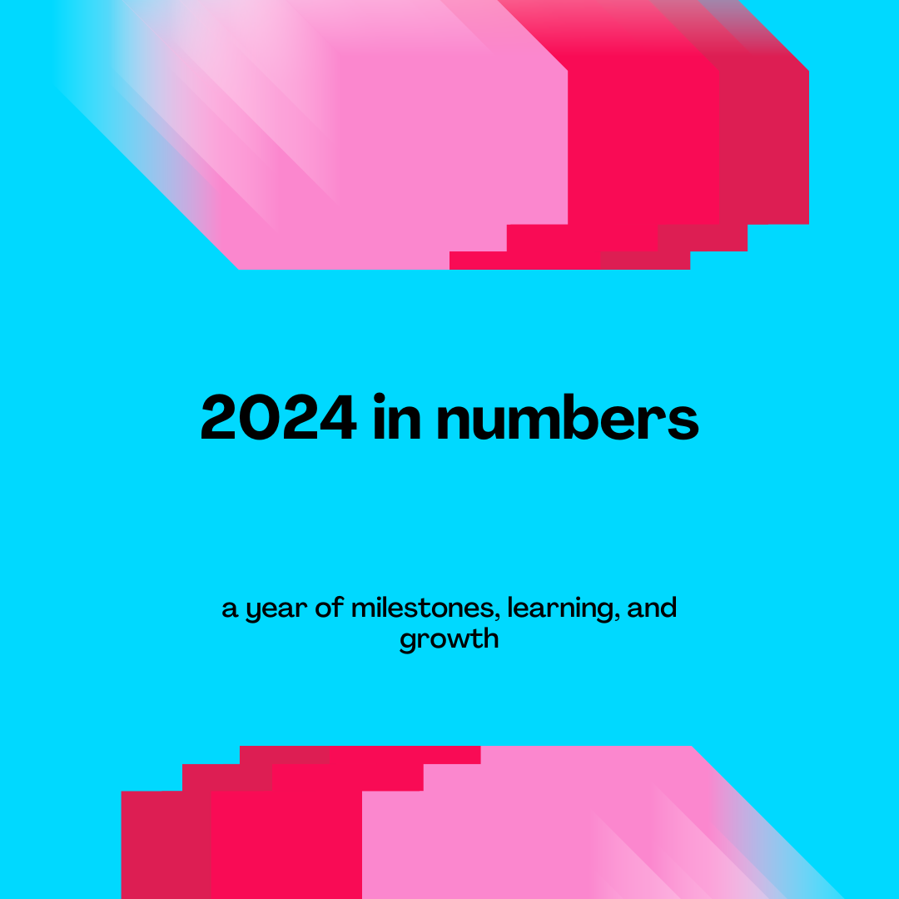

```{r setup, include=FALSE}
knitr::opts_chunk$set(echo = FALSE)
```

As the year comes to a close, we wanted to take a step back, analyze our team’s activities, and celebrate how far we’ve traveled — both figuratively and literally. Much like your favorite year-end music recap, we're wrapping up the past twelve months of our DSAA crew with a highlight reel of what we've been working on, events, and team-building moments. From pushing each other to log record-breaking steps to embracing our creative and competitive sides at seasonal get-togethers, we've had yet another memorable year here at DSAA.

In the summer, we swapped our spreadsheets for sunshine and set sail for the Toronto Islands to enjoy a day of team bonding. After indulging in a picnic feast, we tapped into our creative side by making “plate face” portraits of each other, resulting in some excellent new Slack avatars. [TODO: Insert some photos]. Later, we teamed up for a three-legged relay race that brought out our competitive spirit — not to mention a few epic wipeouts.

As the leaves turned orange, DSAA hosted another in-office Halloween celebration. A costume contest brought pop culture icons and mythical creatures to life, while pumpkin carving revealed hidden artistic talents [TODO: insert photos]. The event culminated in a murder mystery that had us go from data detectives to crime detectives—all while we enjoyed some Detroit-style pizza from [Afro's Pizza](https://www.afrospizza.ca/).

Our two step challenges kept the team on the move. The highest one-day record soared to an impressive **38,226 steps**, while we maintained team averages that showed steady dedication: 10,118 and 10,905 steps per day in the May and September challenges, respectively. As we moved into the holiday season, we wrapped up the year on a creative note: a virtual holiday event with homemade holiday cards designed to pixel perfection using MS Paint and a generous serving of memes that had us laughing and reminiscing on the year's events. [TODO: insert some photos]

Alongside our team’s social endeavors, we’ve also been hard at work refining and delivering data-driven solutions for patient care and operational efficiency. Over the past year, we deployed several new projects and features, including our [CHARTWATCH integration at St. Joe’s](https://unityhealth.to/2024/09/ai-tool-study/), [predictive modelling for Traumatic Brain Injury (TBI)](https://pubs.rsna.org/doi/10.1148/ryai.230088), a scheduling optimization tool for MRI technicians, an ED Under-sheltered Report, and a GIM Resident Scheduling Tool. We also launched the EDQ decision support system with our commercial partner, [Signal1](https://unityhealth.to/2022/04/ai-solutions/). In another collaborative project, we partnered with a provincial organization to build and deploy a demand forecasting application to assist with resource planning.

This year also brought a major transformation at Unity Health Toronto with [the launch of Epic](https://unityhealth.to/patients-and-visitors/electronic-patient-record-project/), our new electronic patient record (EPR). This meant every DSAA sub-team was (and still is) in high gear: data engineers ensured data flows remained stable post-go-live, product managers worked closely with end-users to guide the transition for our tools, and the data science team worked on establishing data validation and monitoring protocols to determine when models could safely return online and be used. The move to Epic also means that it will be easier than ever for us to deploy tools across the Unity Health Toronto sites as there will be greater harmonization across data sources and systems. After the dust settles, we're excited to expand our reach of the various departments and units we can support through our tools.

Now that you've read our recap of some moments from this year, as a data science team, we are obligated to bring you the stats (yes, even in a blog post!). So let's dive into 2024 by the numbers:



## 2024 in numbers - a year of milestones, learning, and growth

### 3 

> That’s how many blog posts we wrote this year. If you missed them the first time, catch up on them below:

- [Take a patch, leave a patch by Chris Hammill](https://lks-chart.github.io/blog/posts/2024-10-01-take-a-patch-leave-a-patch/)

- [AI Success Begins at Intake by Otis Ding and Michael Page](https://lks-chart.github.io/blog/posts/2024-07-16-ai-success-begins-at-intake/)

- [What, you guys are writing unit tests? by Chloe Pou-Prom](https://lks-chart.github.io/blog/posts/2024-05-21-wait-you-guys-are-writing-unit-tests/)

### 4

> The number of sprints we dedicated to improvements and addressing technical debt

- We have previously described our improvement sprints in our other wrapped blog posts.

- Improvement sprints are sprint cycles dedicated to improving our internal processes in data infrastructure, source system optimization, devops, data governance, project management, and more.

- This year, we also introduced “fix-it” sprints. . Borrowed from [Greg Wilson](https://third-bit.com/2024/03/08/our-process/), the goal of the fix-it sprint is to dedicate one sprint cycle to address technical debt. While this has no visible effect for end-users, this helps us in the long-run as we end up with more uptime, better experiences, and faster processing. Examples of things achieved during fix-it:
    - Major package upgrades
    - Cleaning out our instances of Posit Connect, Github, Gitlab
    
- The improvement sprint and fix-it sprint are great opportunities for us to try out new things. In particular, this year, we dedicated time to exploring various LLM libraries and evaluation approaches, as well as further experimenting with CI/CD.

## 42
> The answer to [the Ultimate Question of Life, the Universe, and Everything](https://en.wikipedia.org/wiki/42_(number)#The_Hitchhiker's_Guide_to_the_Galaxy). That’s also how big our team has grown to. This number includes 31 humans, 6 cats, and 5 dogs.

## A lot
> Number of jump scares in Prometheus (the movie). Coincidentally, that's also the number of projects/services/hosts/databases/etc we are monitoring with [Prometheus](https://prometheus.io/) (the monitoring and alert management platform)

- On the subject of monitoring... with great ~~power~~ data comes great ~~responsibility~~ expectations. :detective: The transition to Epic was a great opportunity for us to spend some time on data quality. In particular, we looked into packages and frameworks that would allow us to identify changes in data pre- and post-Epic. 

## 23 

> The number of Epic certificates our team has obtained through completing Epic courses.

## 100 

> The number of bi-weekly Advanced Analytics (AA) team meetings we reached this year.

## Our goals and aspirations for the upcoming year:

- More monitoring! More observability!

- More generative AI! 
    
    - We've already started experimenting with retrieval-augmented generation (RAG) and hope to have something ready soon... 
    
- More steps! :walking: :walking: :walking:
    - :musical_note: We would walk ~~500 miles~~ 10,905 steps. And we would walk ~~500~~ 10,905 more :musical_note:  
    

<sub>The "DSAA wrapped" graphics used in this post were created in Canva.</sub>