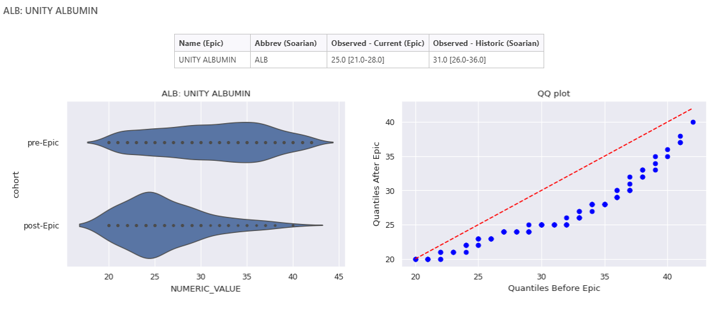

Back in November 2024, as the hospital network prepared for the launch of its new EPR system, Epic :cow2:, DSAA was busy at work building data validation dashboards to ensure smooth sailing during the transition. Our mission? To validate the new data flowing out of Epic against the historical data from Soarian. One of the dashboards created was dedicated to patient labs and vitals, with the ultimate goal of getting our trusty AI tool, [CHARTwatch](https://unityhealth.to/2024/07/innovating-care-experience-with-ai/), back up and running again.

When we first started building this dashboard, we had a bit of a problem: we had no idea what the new data would look like. So, we focused our efforts on building a few different visualizations and generating summary statistics in the hopes of creating a comprehensive validation tool. We included medians, IQRs, and counts (quick gut check stats), along with density and QQ plots for a more in-depth investigation.

Now fast-forward to today, with data flowing in from Epic (or should we say trickling in?), we get to put our dashboards to the test! Our first challenge faced is that patient labs and vitals are limited to current patients only. There's currently no easy way to lookback to patients that have been in and out of the hospital since Epic went live in December 2024. This makes it tricky to compare the new data to the historical data. Any deviation observed between the pre-Epic and post-Epic data raises the question, is the data weird or are the current patients sicker? Despite this, some labs are providing "good" vibes, like the sodium lab (above) :green_heart: :salt:. Whereas others are raising red and yellow flags, demanding closer attention :detective::

-   **O2 Saturation, Venous**: On first glance of the summary statistics and the density plots, alarm bells were ringing :rotating_light:! The new data had a median of 76 compared to 0.72 historically, and the distributions weren't overlapping at all?! But thanks to our trusty QQ plot, we can see that this looks like a scaling issue as the quantiles generally follow a straight line :green_heart:, where values in epic are 100x that of historic values (think 78 vs .78).

-   **Eosinophils**: A yellow flag here :yellow_circle:. The new median appears to at least be within the IQR of the historical data, however the figures reveal a loss of precision, and possibly even rounding up to the nearest decimal place? The decreased precision makes it hard to draw conclusions about data quality, as the new data appears discrete compared to our historical data. Further investigation is needed here to discover the rounding rules, especially given that the mode of the new data appears to be 0.1, while historically it was about 0.02.

-   **Albumin**: :rotating_light: Lots of red flags raised here! The current median is outside the historical IQR :triangular_flag_on_post:, and to make things even more interesting the distributions have different modes :triangular_flag_on_post: and are skewed in opposite directions :triangular_flag_on_post:! This lab definitely requires some further investigation, as these discrepancies could mean something's gone awry with how the data is being captured or processed.

While the new Epic system is up and running, DSAA still has its hands full getting all the AI tools back into action. But on the bright side, there have been plenty of opportunities for growth and learning along the way. Some of the highlights include:

-   Sharpening our python programming skills, [with a hint of R thanks to the polars library](https://blog.tidy-intelligence.com/posts/dplyr-vs-polars/)

-   [Exploring QMD dashboards](https://quarto.org/docs/dashboards/interactivity/shiny-python/index.html)

-   Deploying to the new PositConnect instance
