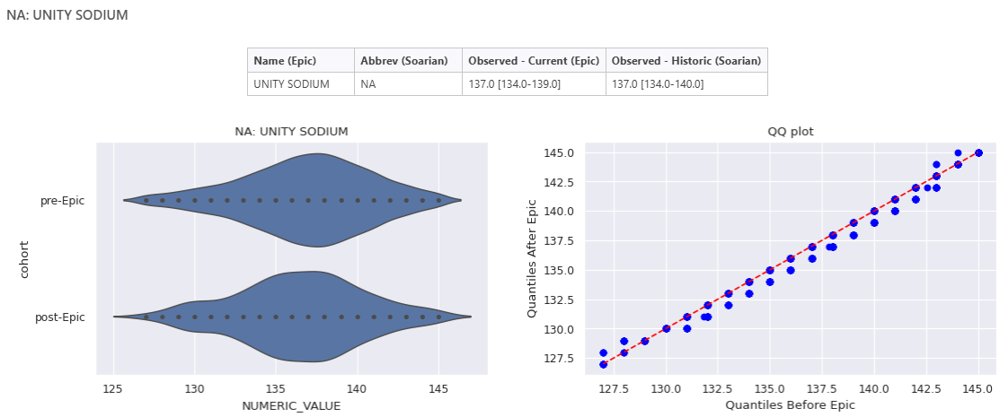
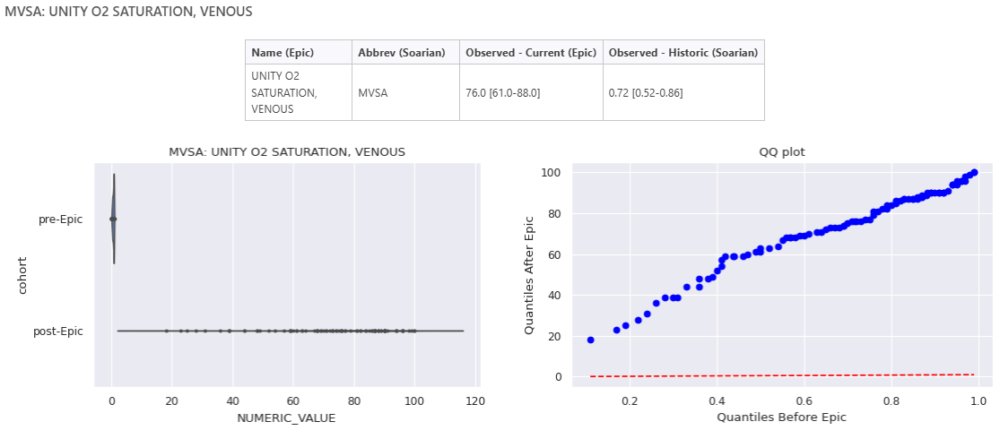
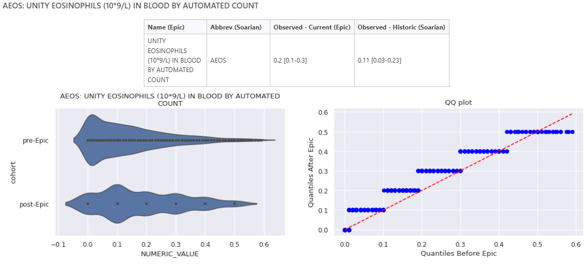

Back in November 2024, as the hospital network prepared for the launch of its new EPR system, Epic :cow2:, DSAA was busy at work building data validation dashboards to ensure smooth sailing during the transition. Our mission? To validate that the brand new data we're seeing looks like what we'd expect from historical data. Once we have "enough good" data we can proceed to the next step, model validation, before relaunching our AI tools :rocket:.

## Dashboard construction

We created a number of dashboards and tests for ourselves with a variety of tools (e.g., pointblank). One of the dashboards created was dedicated to patient labs and vitals, with the general goal of highlighting potential issues for any of our inpatient tools and, more specifically, to help prioritize the relaunch of [CHARTwatch](https://unityhealth.to/2024/07/innovating-care-experience-with-ai/).

When we first started building this dashboard, we had a bit of a problem: we had no idea what the new data would look like. So, we focused our efforts on one measure at a time, building a few different visualizations and generating summary statistics in the hopes of creating a comprehensive validation tool. We included medians, IQRs, and counts (quick gut check stats), along with violin and QQ plots for a more in-depth investigation of each lab and vital.

## Vibe check

Now fast-forward to today, with data flowing in from Epic, we get to put our dashboards to the test! Our first challenge faced is that for the time being, patient labs and vitals are limited to current patients only. While we're working with many people across the organization to ensure we have historic data access, until then, the daily data makes it tricky to compare the new data to the historical data. Any deviation observed between the pre and post go-live data raises the question, is the data weird or are the current patients sicker?

Working with what we currently have, we dove in right away. Some measures are providing "good" vibes, like the sodium lab (above) :green_heart: :salt:. Whereas others are raising yellow and even (possible) red flags, demanding closer attention :detective:

-   **Venous O2 Saturation, measures the bloods' oxygen content returning to the heart**: On first glance of the summary statistics and the violin plots, alarm bells were ringing :rotating_light:! The new data had a median of 76 compared to 0.72 historically, and the distributions weren't overlapping at all?! But thanks to our trusty QQ plot, we can see that this looks like a scaling issue as the quantiles generally follow a straight line :green_heart:, where what we're able to observe are 100x that of historic values (think 78 vs .78).

-   **Eosinophils, a count of a type of white blood cell**: A yellow flag here :yellow_circle:. The new median appears to at least be within the IQR of the historical data, however the figures reveal a loss of precision, and possibly even rounding up to the nearest decimal place? The decreased precision makes it hard to draw conclusions about data quality, as the new data appears discrete compared to our historical data. Further investigation is needed here to discover the rounding rules, and verify that after rounding the data is comparable.

## What's next

These are only three out of 200+ measures we're validating, and we have a ways to go to understand each of them. Our next step, once the data pipelines are in place, will be to compare the historical data to the entire post go-live data, providing larger samples and stronger vibes.

It's clear DSAA still has its hands full with data and model validation before putting their AI tools back into action. But on the bright side :sun_with_face:, there have been plenty of opportunities for growth and learning along the way. Some of the highlights include:

-   Sharpening our Python programming skills, with a hint of R thanks to the [`polars`](https://blog.tidy-intelligence.com/posts/dplyr-vs-polars/), [`great-tables`](https://www.appsilon.com/post/great-tables), and [`skimpy`](https://aeturrell.github.io/skimpy/) libraries

-   [Exploring QMD dashboards](https://quarto.org/docs/dashboards/interactivity/shiny-python/index.html)

-   Updating our Posit Connect instance
