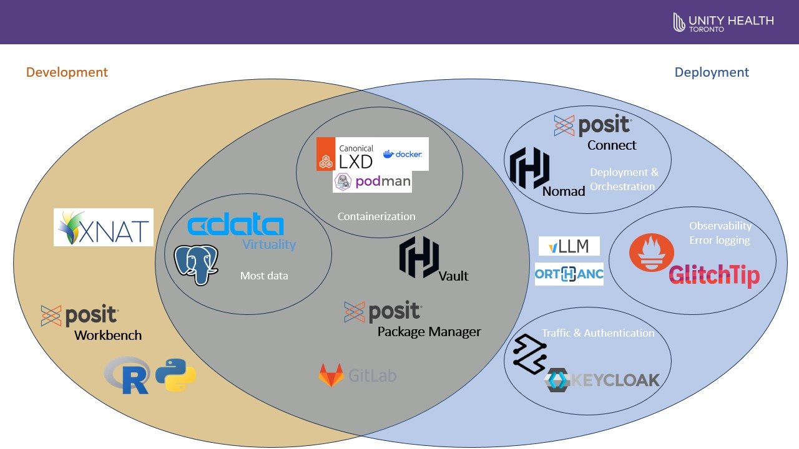

```{r setup, include=FALSE}
knitr::opts_chunk$set(echo = FALSE)
```


Over the years we've frequently been asked how we do what we do. Most of the time that means process, strategy and vision, change management, and whole bunch of other things. We even have [an entire course explaining pretty much everything](https://unityhealth.to/about-unity-health/ai-at-unity-health/health-ai-academy/).

But one thing we only sporadically or partially describe are the technical and technological bits and pieces that get us from idea to product. Until recently we were visited by a delegation from the UK representing compute and infrastructure. So we had to pull together new materials. And we compressed it all down into one slide!


Without further ado, *The Slide!*:




## The Details

If you've made it this far (which isn't all that far) you're probably expecting some details. Great! We're going to share some of the details! First, we borrowed the structure and format of our slide from some of our friends at [Sahlgrenska](https://www.sahlgrenska.se/en/about-the-hospital/). So shout out to them. Next, a few bullet points with the major highlights:


* The obvious: R and Python are essential languages for us.
* The somewhat obvious: [CData Virtuality](https://www.cdata.com/virtuality/start/) and Postgres handle a lot of our data
* The suite of tools: We use a handful of tools from [Posit](https://docs.posit.co/posit-team/): Workbench, Package Manager, and Connect. Workbench and Package Manager are core development tools. For us, Connect is an internal deployment platform where we keep some scheduled models or model APIs, and especially our data and model monitoring tools.
* The "make it work" tools: All the containerization (e.g., LXD, podman), traffic, authentication/secrets (Keycloak and Vault), and orchestration ([Nomad](https://developer.hashicorp.com/nomad)) tools
* The "wakes us up at night" tools: [Prometheus](https://prometheus.io/) and [GlitchTip](https://glitchtip.com/) help us monitor our systems and find out what's wrong. Incredibly useful when it's 2 a.m. 
* The tools that help us push boundaries: We use [XNAT](https://www.xnat.org/) and [Orthanc](https://www.orthanc-server.com/) for medical imaging storage, viewing, annotating (all XNAT) and in our deployments (Orthanc). [vLLM](https://vllm.ai/) helps us deploy our language and generative AI models 
* The arguably most central tool: Gitlab. It does so much. Keeps everything version controlled, facilitates deployments, tracks our project status and goals. 
* Hiding amongst the above is a reproducibility focused package manager called Nix. We talked about it [here](https://lks-chart.github.io/blog/posts/2023-02-28-medical-imaging-with-nix/) in the context of medical imaging.


## Years of work

It feels pretty good that we can, now, easily compress everything into a slide and a few bullet points that get to the (technical and technological) "how do you do what you do?" 

It's something that's taken years, a lot of expertise, even more learning, and sometimes hitting some (major!) roadblocks. It's been quite a journey and on that journey we've matured to this state. 